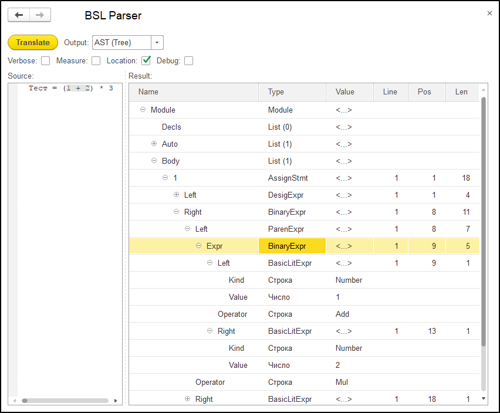

# BSL-Parser
[](https://gitter.im/Lead-Bullets/BSL-Parser?utm_source=badge&utm_medium=badge&utm_campaign=pr-badge&utm_content=badge)

BSL-Parser - это парсер встроенного языка платформы 1С:Предприятие 8 (далее "язык 1С")

Данный проект представляет из себя набор внешних обработок для платформы 1С:Предприятие версии 8.3

Обработки совместимы с интерпретатором [OneScript](https://github.com/EvilBeaver/OneScript)

# Цели проекта

* Создать удобный инструмент для работы с исходным кодом на языке 1С как с данными
* Выработать методы анализа и преобразования программ на языке 1С
* Выработать методы ограничения семантики языка под конкретную задачу или проект
* Получить новые знания и умения

# Мотивация

Разработка ПО практически никогда не ограничивается одними лишь правилами языка реализации. Многие команды следуют определенным общепринятым стандартам и правилам разработки, а каждый конкретный проект имеет еще и свою собственную специфику. Проверка проекта на соответствие всем требованиям - это довольно сложный и затратный процесс. А сократить затраты (кажется) можно с помощью автоматизации проверок. Эта мысль была толчком к началу работы над данным проектом.

# Философия

* Make it as simple as possible, but not simpler
* Не привлекай сторонних технологий без необходимости
* Не ведись на модные течения
* Не сцы

# Структура репозитория

* /docs - файлы веб-страницы проекта <https://lead-bullets.github.io/BSL-Parser>
* /gui - исходники обработки, предоставляющей графический пользовательский интерфейс к парсеру (в целях отладки)
* /img - картинки для документации
* /oscript - скрипты для проверки работы парсера на интерпретаторе [OneScript](https://github.com/EvilBeaver/OneScript)
* /plugins - исходники обработок-плагинов
* /src - исходники обработки парсера
* /prepare.ps1 - скрипт подготовки окружения для использования скриптов сборки/разборки обработок
* /common.ps1 - скрипт с общими алгоритмами
* /build.ps1 - скрипт сборки обработок с помощью конфигуратора в режиме агента
* /explode.ps1 - скрипт разборки обработок с помощью конфигуратора в режиме агента
* /temp.dt - выгрузка пустой базы, которая необходима для работы конфигуратора в режиме агента

# Системные требования

Для использования обработок необходима либо установленная платформа 1С:Предприятие версии 8.3, либо интерпретатор [OneScript](https://github.com/EvilBeaver/OneScript)

Операционная система значения не имеет. Но сборочные скрипты в текущей реализации будут работать только в Windows (эти скрипты не обязательны).

Если вы хотите принять участие в проекте, то вероятно потребуется [git](https://git-scm.com/) и аккаунт на github.

# Сборка проекта

Вы можете либо клонировать репозиторий с помощью [git](https://git-scm.com/):
```ps
git clone https://github.com/Lead-Bullets/BSL-Parser
```
либо просто скачать и распаковать zip-архив: https://github.com/Lead-Bullets/BSL-Parser/archive/master.zip

Исходники обработок в данном проекте выгружены стандартными средствами конфигуратора платформы 1С:Предприятие версии 8.3. Для сборки вы можете просто открыть файл `xml` в конфигураторе как есть и пересохранить в формате `epf`

Также можно воспользоваться скриптами на **powershell**, которые находятся в корне. Сначала нужно запустить скрипт `prepare.ps1`, который установит модуль для работы с протоколом SSH (нужен для агента конфигуратора) и развернет пустую базу в папке `/temp`. Если ошибок не возникло, то запуск скрипта больше не потребуется. После этого вы можете запустить скрипт `build.ps1`, который соберет обработки в папке `/build`. Обратную операцию можно выполнить запустив скрипт `explode.ps1`

Скрипты могут иногда не срабатывать, но повторный запуск обычно помогает :)
Пользоваться скриптами нужно **осторожно**, чтобы не потерять свои правки.

Если вы будете использовать парсер в среде [OneScript](https://github.com/EvilBeaver/OneScript), то сборка вообще не требуется.

# Быстрый старт
1. Клонировать репозиторий и собрать обработки (см. выше "Сборка проекта")
2. Открыть обработку build/gui.epf в управляемом приложении любой файловой базы (обработка BSLParser.epf должна лежать рядом с gui.epf)
3. Вставить исходный код на языке 1С в поле `Source`
4. В поле `Output` выбрать `AST (tree)`
5. Нажать кнопку `Translate`
6. В поле `Result` будет выведено [AST](https://ru.wikipedia.org/wiki/%D0%90%D0%B1%D1%81%D1%82%D1%80%D0%B0%D0%BA%D1%82%D0%BD%D0%BE%D0%B5_%D1%81%D0%B8%D0%BD%D1%82%D0%B0%D0%BA%D1%81%D0%B8%D1%87%D0%B5%D1%81%D0%BA%D0%BE%D0%B5_%D0%B4%D0%B5%D1%80%D0%B5%D0%B2%D0%BE) вашего исходного кода. Если предварительно был выставлен флаг `Location`, то двойной клик на узле в дереве будет выделять соответствующий этому узлу участок исходного кода.
7. Для запуска плагина нужно в поле `Output` выбрать `Plugin` и указать файл обработки-плагина. Затем нажать `Translate`. В поле `Result` будет выведен результат работы плагина.

**Внимание!** Режим отладки существенно снижает скорость работы парсера.



# Принцип работы

Решение на базе данного проекта в простейшем случае включает:
* Парсер - обработка BSLParser из этого репозитория
* Плагин к парсеру - любая обработка, имеющая определенный программный интерфейс

Парсер разбирает переданный ему исходный код и возвращает модель этого кода в виде [абстрактного синтаксического дерева](https://ru.wikipedia.org/wiki/%D0%90%D0%B1%D1%81%D1%82%D1%80%D0%B0%D0%BA%D1%82%D0%BD%D0%BE%D0%B5_%D1%81%D0%B8%D0%BD%D1%82%D0%B0%D0%BA%D1%81%D0%B8%D1%87%D0%B5%D1%81%D0%BA%D0%BE%D0%B5_%D0%B4%D0%B5%D1%80%D0%B5%D0%B2%D0%BE). Узлы этого дерева соответствуют синтаксическим конструкциям и операторам языка. Например, конструкция `Пока <условие> Цикл <тело> КонецЦикла` представлена в дереве узлами типа `WhileStmt`, в которых условие представлено в подчиненном узле-выражении `Cond`, а тело хранится в массиве узлов-операторов `Body`. Данных в дереве достаточно для полного восстановления по нему исходного кода вместе с комментариями, за исключением некоторых деталей форматирования. Порядок и подчиненность узлов в дереве в точности соответствует исходному коду. Каждый узел хранит номер строки, позицию начала и длину участка кода, который он представляет. Описание узлов и элементов дерева вы можете найти на веб-странице проекта: https://lead-bullets.github.io/BSL-Parser

После формирования дерева запускается общий механизм обхода дерева, который при посещении узла вызывает обработчки, подписанных на этот узел плагинов. Полезная (прикладная) работа выполняется именно плагином. Это может быть сбор статистики, поиск ошибок, анализ цикломатической сложности, построение документации по коду и т.д. и т.п. Кроме того плагин может построить модификацию исходного дерева, путем замены одних узлов на другие (например, в целях оптимизации).

Состояние плагина (в переменных модуля обработки) сохраняется между вызовами до самого конца обхода дерева, а подписки на каждый узел возможны две: перед обходом узла и после обхода. Это существенно упрощает реализацию многих алгоритмов анализа. Плюс к этому некоторую информацию предоставляет сам механизм обхода. Например, плагинам доступна статистика по родительским узлам (количество каждого вида).